# Generative AI and Multi-Modal Agents in AWS: The Key to Unlocking New Value in Financial Markets

This file walks you through how to set up the infrastructure and applications, and run the code to create a multi-modal agents. The blog post provides a detailed discussion of this solution. This Solution uses Full-Access policies for certain services involved in the architecture and may not meet the security standards of certain business units, however, this solution should be used to show the art-of-possible and access policy should be scoped down for any other use.

## Achitecture Diagram

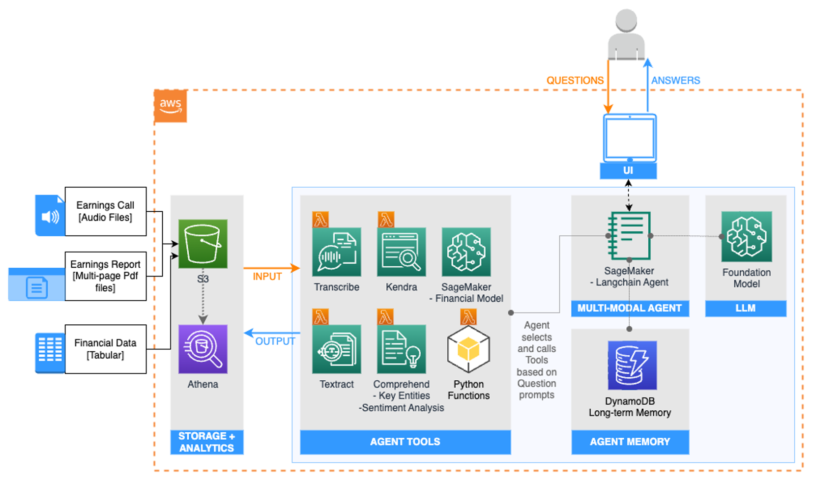


## Prerequisites

This solution uses four [Lambda functions](https://aws.amazon.com/lambda/), which are serverless, event-driven compute services that runs applications. The Python code for the applications are packaged as zip files, stored in *lambda_zip_files* in this repo. We need to add them to an S3 bucket in your account in order to set up the Lambda functions.

First, make an S3 bucket. Go to S3 page in AWS, click "Create bucket". Then enter a bucket name, which should be universally unique. Take a note of the name, because we will need it in another section. Leave the rest as default, and click "Create bucket" at the bottom of the page.

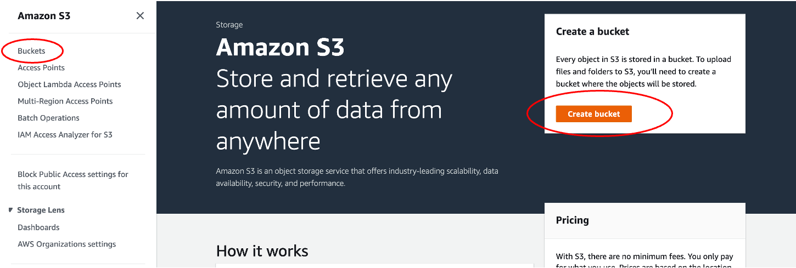


Once the bucket is created, click the bucket name, and create a folder called *code*. To create a folder, click "Create folder", and then enter the folder name "code", then click "Submit".

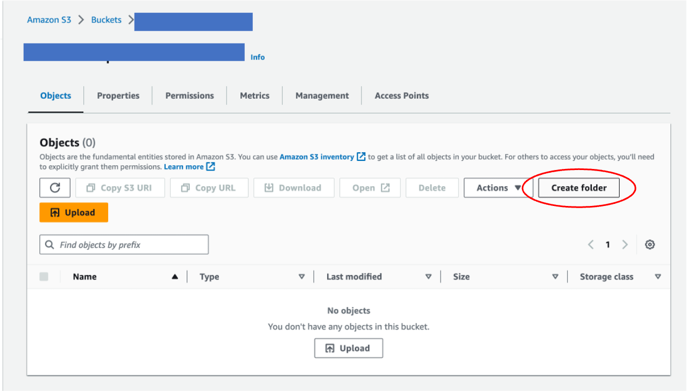

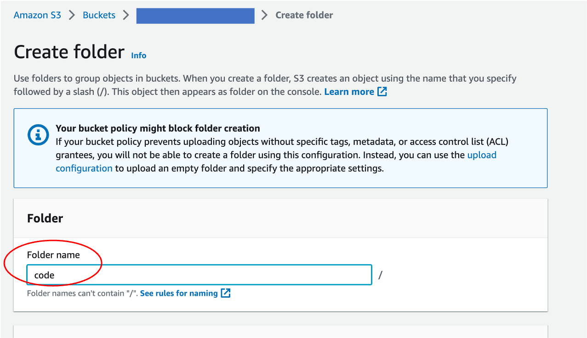

Upload the four zip files in folder *lambda_zip_files* to the S3 bucket. 

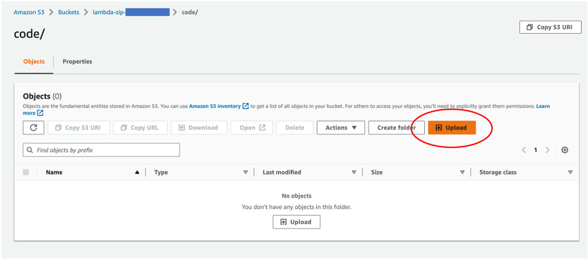

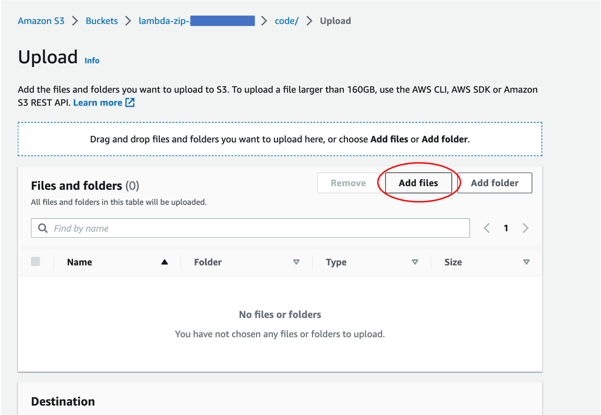

This Soluition requires Anthropic Claude2 model in Bedrock. Make sure you have access to the model in Bedrock.
Navigate to the Bedrock console and click on **Model Access** to the left tab. Select the **Manage model access** button to the top-right.
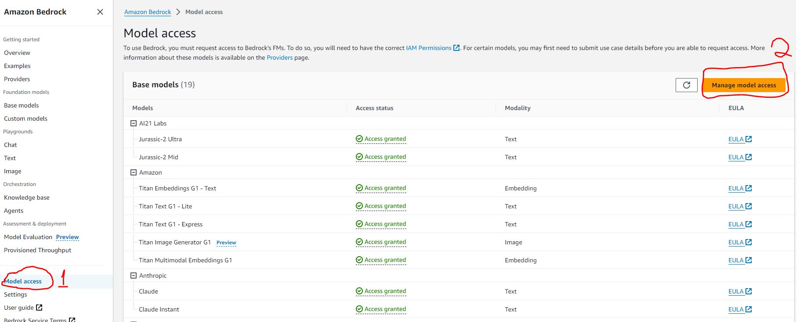

Submit the **Use case details** and select the checkboxes beside the Anthropic models. Then select **save changes** button.
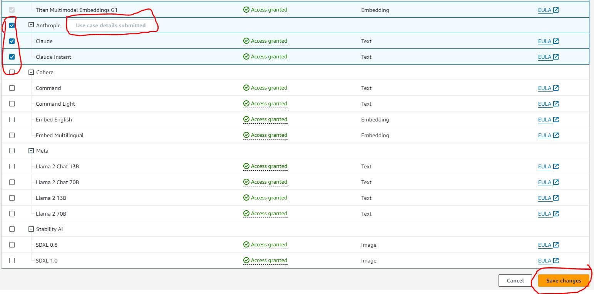

## Create infrastructure using CloudFormation

[AWS CloudFormation](https://aws.amazon.com/cloudformation/) allows you to create infrasturecture as code. 

First, download the CloudFormation template *Consolidated-cfn.yaml*. 

Then upload it in CloudFormation to create a stack. This stack sets up the necessary infrastructure, such as IAM roles and Lambda functions. Go to CloudFormation console in AWS, click Stacks -> Create stack -> With new resources (standard). 


Upload *Consolidated-cfn.yaml*, and click "Next". 

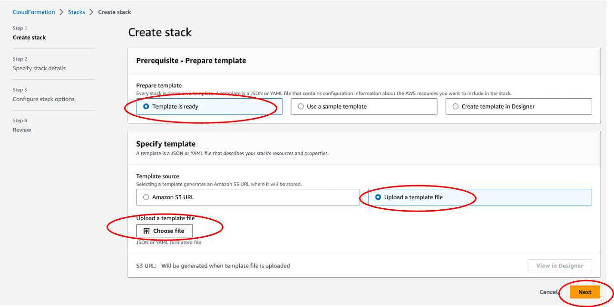


On the "Specify stack details" page, 

Give the Stack a name. Take a note of this name as we will need it when running the app. Change the "SourceCodeBucket" to the name of the S3 bucket you created above.

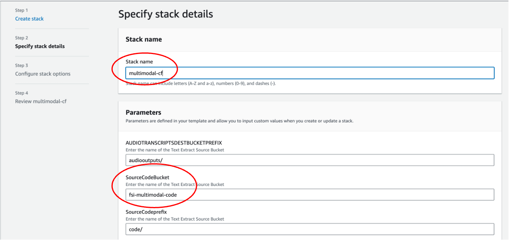

Leave the rest as default. Check the acknowledgement box on the last page and submit it. 

It takes a few minutes to create. Once it is created, you can check the generated resources by clicking on Stacks -> Stack Name. Then click "Resources". The example below shows that the AudioTranscriptsSourceBucketResource is an S3 bucket with the bucket name "test-cf-stack-audiotranscriptssourcebucketresourc-1kg41ts9dy7hk".

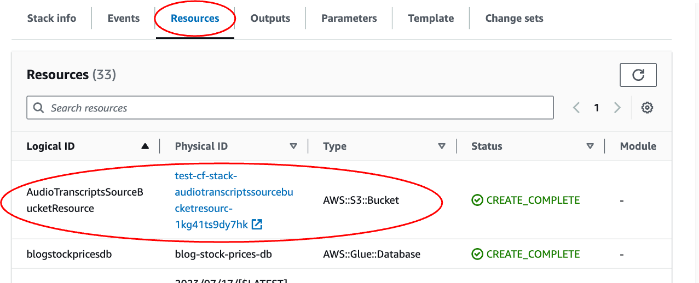


## Upload the Jupyter Notebook

The CloudFormation stack creates a SageMaker Notebook instance that we can use to run the .ipynb file. 

Go to SageMaker page, and click Notebook -> Notebook instances. You will see a Notebook instance named "MultiModalSagemakerInstance". Click "Open jupyter" next to it.

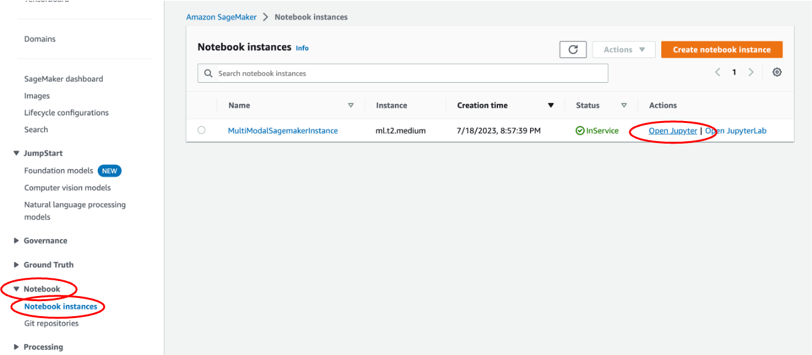


## Pull in the code

On Jupyter Notebook, click New -> Terminal. This opens a command-line interface.


Copy and paste the following command lines to pull the code from Github.

```
git init
git clone [github_link]

```
## Set Up StreamLit Front-End

The streamlit app for this prioject is located in *app_complete.py*.
It uses dependencies located in the utility folder. 

To run this Streamlit App on Sagemaker Studio follow the steps in the link below:
* [Set Up SageMaker Studio](https://docs.aws.amazon.com/sagemaker/latest/dg/onboard-iam.html)
    - Use the sagemaker execution role `SageMakerRole` deployed by the cloudformation template above for your SageMaker Studio Domain default execution role.
* [Launch SageMaker Studio](https://docs.aws.amazon.com/sagemaker/latest/dg/studio-launch.html)
* [Clone this git repo into studio](https://docs.aws.amazon.com/sagemaker/latest/dg/studio-tasks-git.html)
* Change the values for the variables `REGION` and `STACK_NAME` to the region you are working in and name of the deployed cloudformation stack respectively in `app_complete.py`
* Open a system terminal by clicking on **Amazon SageMaker Studio** and then **System Terminal** as shown in the diagram below
* 
* Navigate into the cloned repository directory using the `cd` command and run the command `pip install -r requirements.txt` to install the needed python libraries
* Run command `python3 -m streamlit run app_complete.py` to start the Streamlit server. Do not use the links generated by the command as they won't work in studio.
* To enter the Streamlit app, open and run the StreamlitLink.ipynb notebook. This will generate the appropiate link to enter your Streamlit app from SageMaker studio. Click on the link to enter your Streamlit app. Happy querying :)
* **⚠ Note:**  If you rerun the Streamlit server it may use a different port. Take not of the port used (port number is the last 4 digit number after the last :) and modify the `port` variable in the `StreamlitLink.ipynb` notebook to get the correct link.

To run this Streamlit App on AWS EC2 (I tested this on the Ubuntu Image)
* [Create a new ec2 instance](https://docs.aws.amazon.com/AWSEC2/latest/UserGuide/EC2_GetStarted.html)
    - Use the sagemaker execution role `SageMakerRole` deployed by the cloudformation template above for your [ec2 instance profile IAM role](https://docs.aws.amazon.com/IAM/latest/UserGuide/id_roles_use_switch-role-ec2_instance-profiles.html).
* Expose TCP port range 8500-9000 on Inbound connections of the attached Security group to the ec2 instance. TCP port 8501 is needed for Streamlit to work. See image below
* 
* [Connect to your ec2 instance](https://docs.aws.amazon.com/AWSEC2/latest/UserGuide/AccessingInstances.html)
* Run the appropiate commands to update the ec2 instance (`sudo apt update` and `sudo apt upgrade` -for Ubuntu)
* Clone this git repo 
* Change the values for the variables `REGION` and `STACK_NAME` to the region you are working in and name of the deployed cloudformation stack respectively in `app_complete.py`. Make use of the `nano` command to make this changes. e.g. `nano app_complete.py`
* Install python3 and pip if not already installed
* Install the dependencies in the requirements.txt file by running the command `sudo pip install -r requirements.txt`
* Run command `python3 -m streamlit run app_complete.py` 
* Copy the external link and paste in a new browser tab

## Security

See [CONTRIBUTING](CONTRIBUTING.md#security-issue-notifications) for more information.

## License

This library is licensed under the MIT-0 License. See the LICENSE file.

