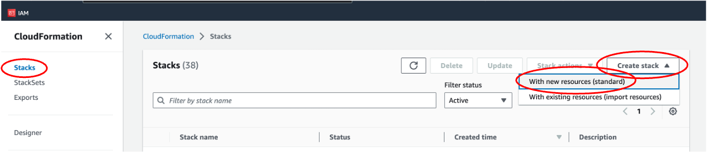

# Generative AI and Multi-Modal Agents in AWS: The Key to Unlocking New Value in Financial Markets

This is the code repo of the blog [Generative AI and Multi-Modal Agents in AWS: The Key to Unlocking New Value in Financial Markets](https://www.amazon.com).

This file walks you through how to set up the infrastructure and applications, and run the code to create a multi-modal agents. The blog post provides a detailed discussion of this solution. 

## Architecture Diagram


## Prerequisites

**In order to run this solution, the user must have an API key to a Large Language Model (LLM) such as [Anthropic Claud2](https://www.anthropic.com/index/claude-2), or have access to [Amazon Bedrock](https://aws.amazon.com/bedrock/)'s foundation models.**

This solution uses five [Lambda functions](https://aws.amazon.com/lambda/), which are serverless, event-driven compute services that runs applications. The Python code for the applications are packaged as zip files, stored in *lambda_zip_files* in this repo. We need to add them to an S3 bucket in your account in order to set up the Lambda functions.

First, make an S3 bucket. Go to S3 page in AWS, click "Create bucket". Then enter a bucket name, which should be universally unique. Take a note of the name, because we will need it in another section. Leave the rest as default, and click "Create bucket" at the bottom of the page.


Once the bucket is created, click the bucket name, and create a folder called *code*. To create a folder, click "Create folder", and then enter the folder name "code", then click "Submit".


Upload the five zip files in folder *lambda_zip_files* to the S3 bucket. 


## Create infrastructure using CloudFormation

[AWS CloudFormation](https://aws.amazon.com/cloudformation/) allows you to create infrasturecture as code. 

First, download the CloudFormation template *cloudformation.yaml*. 

Then upload it in CloudFormation to create a stack. This stack sets up the necessary infrastructure, such as IAM roles and Lambda functions. Go to CloudFormation console in AWS, click Stacks -> Create stack -> With new resources (standard). 



Upload *cloudformation.yaml*, and click "Next". 


On the "Specify stack details" page, 

Give the Stack a name, such as "multimodal-cf". Take a note of this name as we will need it when running the app. Change the "SourceCodeBucket" to the name of the S3 bucket you created above.


Leave the rest as default. Check the acknowledgement box on the last page and submit it. 

It takes a few minutes to create. Once it is created, you can check the generated resources by clicking on Stacks -> Stack Name. Then click "Resources". The example below shows that the AudioTranscriptsSourceBucketResource is an S3 bucket with the bucket name "test-cf-stack-audiotranscriptssourcebucketresourc-1kg41ts9dy7hk".


## Open SageMaker Notebook Instance

The CloudFormation stack creates a SageMaker Notebook instance that we can use to run the .ipynb file. 

Go to SageMaker page, and click Notebook -> Notebook instances. You will see a Notebook instance named "MultiModalSagemakerInstance". Click "Open jupyter" next to it.


## Pull in the code

On Jupyter Notebook, click New -> Terminal. This opens a command-line interface.

Copy and paste the following command lines to pull the code from Github.

```
cd SageMaker
git init
git clone git@github.com:aws-samples/aiml-genai-multimodal-agent.git
```
Then open *aiml-genai-multimodal-agent/multimodal-demo.ipynb* Python Notebook. This Notebook has the code to run the solution, as well as explanations of each step. 

*The prompts in this solution are based on Anthropic Claude2. If you choose to use a different foundation model, please try tweaking the template. It's just like you would convey the same idea in slightly different ways to different people.*


# Congratulations! After completing the Jupyter Notebook, you've developed a Multi-Modal Agent! 


## Security

See [CONTRIBUTING](CONTRIBUTING.md#security-issue-notifications) for more information.

## License

This library is licensed under the MIT-0 License. See the LICENSE file.

